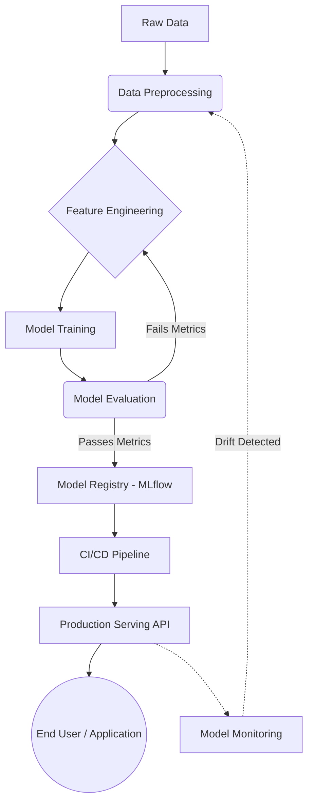

<div align="center">

# 🚀 **MLOps Pipeline Architecture**

[](https://python.org)
[](https://www.docker.com/)
[](https://kubernetes.io/)
[](https://mlflow.org/)
[](https://prometheus.io/)
[](https://grafana.com/)

*An end-to-end Machine Learning Operations framework for scalable model training, tracking, and deployment.*

[Explore Features](#✨-features) •
[Getting Started](#🚀-getting-started) •
[Architecture](#🏗️-architecture) •
[Documentation](#📚-documentation)

</div>

---

## ✨ Features

<details>
<summary><b>1️⃣ Automated Training Pipelines</b></summary>
<br/>
Continuous model training triggered by data updates or scheduled chron jobs. Easily integrate with Airflow or GitHub Actions.
</details>

<details>
<summary><b>2️⃣ Model Tracking & Registry</b></summary>
<br/>
Track parameters, metrics, and models using MLflow. Version control your models seamlessly from experimentation to production.
</details>

<details>
<summary><b>3️⃣ Scalable Deployment</b></summary>
<br/>
Containerize models using Docker and orchestrate with Kubernetes for robust, scalable model serving APIs.
</details>

<details>
<summary><b>4️⃣ Data & Concept Drift Monitoring</b></summary>
<br/>
Built-in monitoring to detect when your model's performance degrades in production, alerting you when retraining is necessary.
</details>

---

## 🏗️ Architecture



---

## 🚀 Getting Started

### Prerequisites
* Python 3.9+
* Docker & docker-compose
* Make

### Installation

1. **Clone the repository**
```bash
git clone https://github.com/yourusername/MLOps.git
cd MLOps
```

2. **Set up the virtual environment**
```bash
make setup
```

3. **Spin up the infrastructure (MLflow, DBs, etc.)**
```bash
docker-compose up -d
```

---

## 💻 Usage

Run the following command to trigger a sample training run:
```bash
python scripts/train.py --config config/train_config.yaml
```

To view the MLflow UI and check your experiments:
```bash
open http://localhost:5000
```

---

## 🤝 Contributing

Contributions, issues, and feature requests are welcome!
Feel free to check the [issues page](https://github.com/yourusername/MLOps/issues).

1. Fork the Project
2. Create your Feature Branch (`git checkout -b feature/AmazingFeature`)
3. Commit your Changes (`git commit -m 'Add some AmazingFeature'`)
4. Push to the Branch (`git push origin feature/AmazingFeature`)
5. Open a Pull Request

---

<div align="center">
Made with ❤️ by the MLOps Team
</div>